# Práctica de Azure

> Iker García Calviño \<iker.gcalvino@udc.es\>

## Despliegue de contenedor mediante Docker Compose en Azure

El objetivo de esta práctica es desplegar, a través de Docker Compose, un contenedor que contenga dos servicios con las imágenes de WordPress y MySQL. La comunicación entre los servicios se realiza de forma interna dentro del contenedor desplegado, exponiendo únicamente el puerto 80 del servicio WordPress al exterior.

## Recursos necesarios en Azure

Azure App Service es el servicio utilizado para hospedar aplicaciones web, API REST y back-ends para dispositivos móviles. Puede ejecutar y escalar aplicaciones en entornos basados en Windows y Linux. Para lanzar un docker-compose en Azure App Service, es necesario desplegarlo sobre un Azure Web App.

## Instrucciones

1. Generar un **Azure App Service** en Linux.
2. Una vez generado el **Web App**, es necesario configurar sus **App Settings** para indicar la ruta y las credenciales (usuario/contraseña) del **Azure Container Registry**. Esto permite que el servicio busque las imágenes en el registro de contenedores de Azure y no en DockerHub (por defecto).

## Documentación

### Descripción del despliegue

Se utilizaron las imágenes de WordPress y MySQL, descargadas desde DockerHub, para crear un contenedor mediante Docker Compose en Azure. A continuación, se detallan los pasos realizados:

1. **Descarga de imágenes desde DockerHub:**

    ```bash
    docker pull wordpress:latest
    ```

    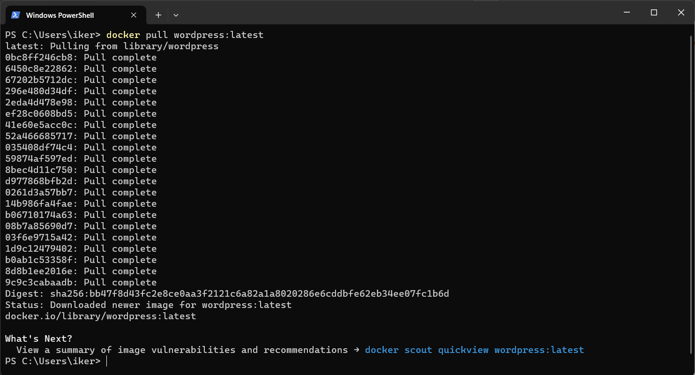

    ```bash
    docker pull mysql:5.7
    ```

    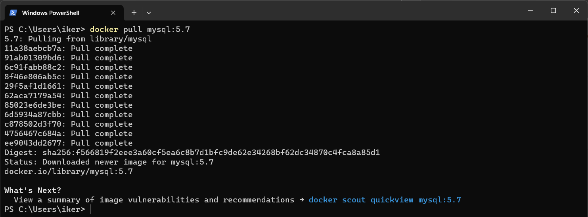

2. **Docker Compose:**

    Se creó un archivo `docker-compose.yml` para definir la configuración del servicio. Este archivo especifica los servicios, las imágenes, las variables de entorno y los volúmenes necesarios.

    ```yaml
    version: '3'

    volumes:
      db:
      wordpress:

    services:
      db:
        image: mysql:5.7
        restart: always
        environment:
          - MYSQL_ROOT_PASSWORD=root
          - MYSQL_DATABASE=wordpress
          - MYSQL_USER=test
          - MYSQL_PASSWORD=test
        ports:
          - "3306:3306"
        volumes:
          - db:/var/lib/mysql

      wordpress:
        depends_on:
          - db
        image: wordpress:latest
        restart: always
        environment:
          - WORDPRESS_DB_HOST=db:3306
          - WORDPRESS_DB_USER=test
          - WORDPRESS_DB_PASSWORD=test
          - WORDPRESS_DB_NAME=wordpress
        ports:
          - "8080:80"
        volumes:
          - wordpress:/var/www/html
    ```

3. **Configuración en Azure:**

    - Creación de un grupo de recursos:

        ```bash
        az group create --name miGrupoRecursos --location "West Europe"
        ```

        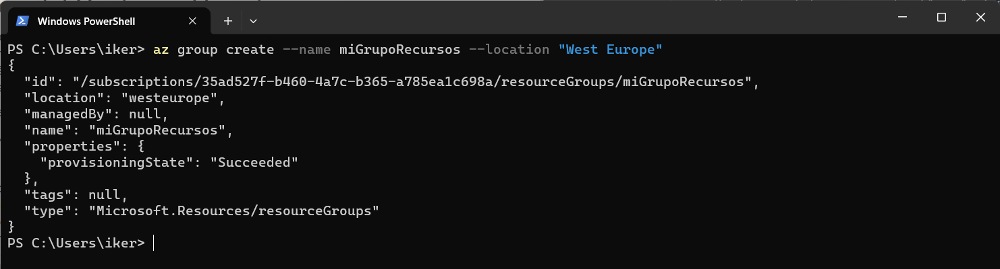

    - Creación de un registro de contenedores en Azure:

        ```bash
        az acr create --name ikergcalvinoregistry --resource-group miGrupoRecursos --sku Basic
        ```

        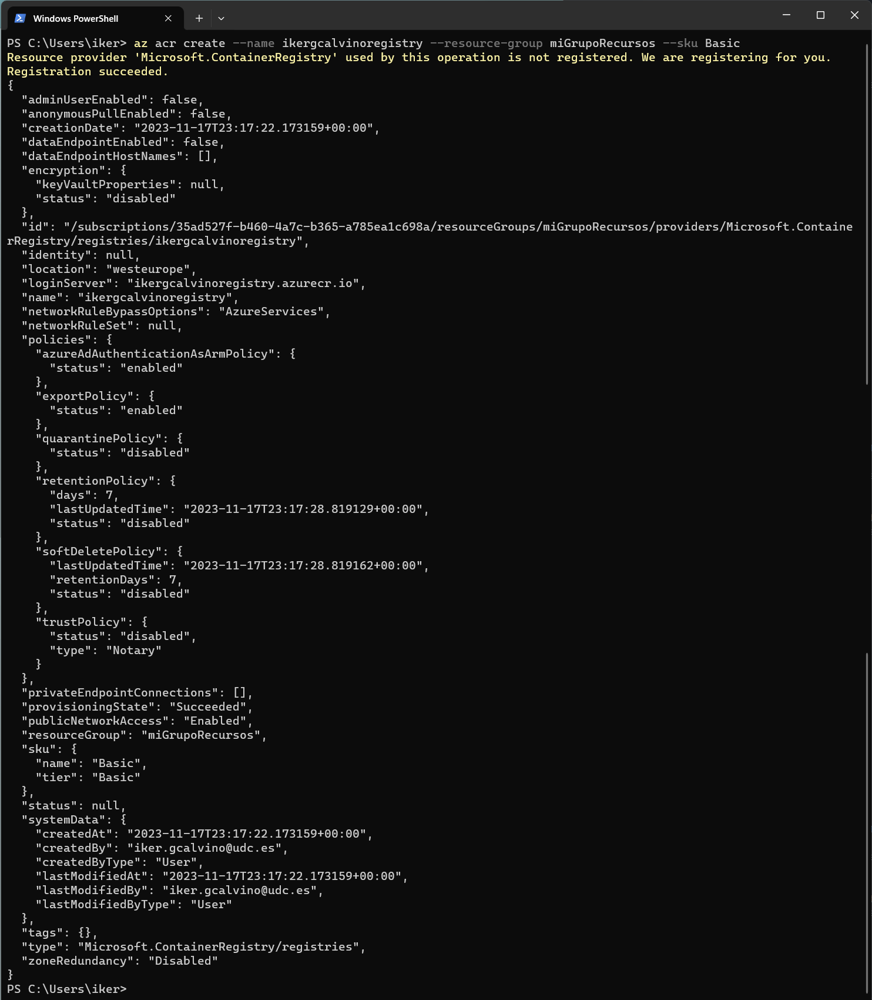

    - Inicio de sesión en el registro de contenedores:

        ```bash
        az acr login --name ikergcalvinoregistry
        ```

        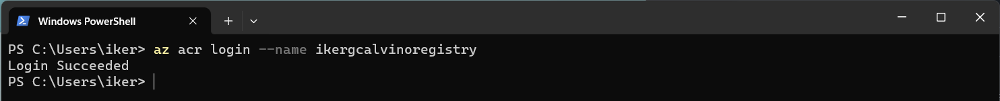

        Tag y push de las imágenes al registro de contenedores de Azure:

        ```bash
        docker tag wordpress:latest ikergcalvinoregistry.azurecr.io/wordpress:latest
        docker tag mysql:5.7 ikergcalvinoregistry.azurecr.io/mysql:5.7
        ```

        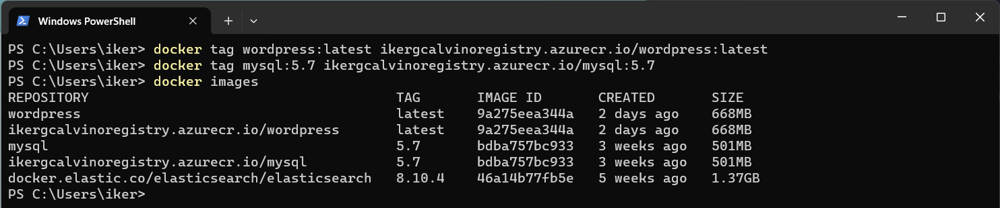

        Habilitación de la autenticación de administrador:

        ```bash
        az acr update -n ikergcalvinoregistry --admin-enabled true
        ```

        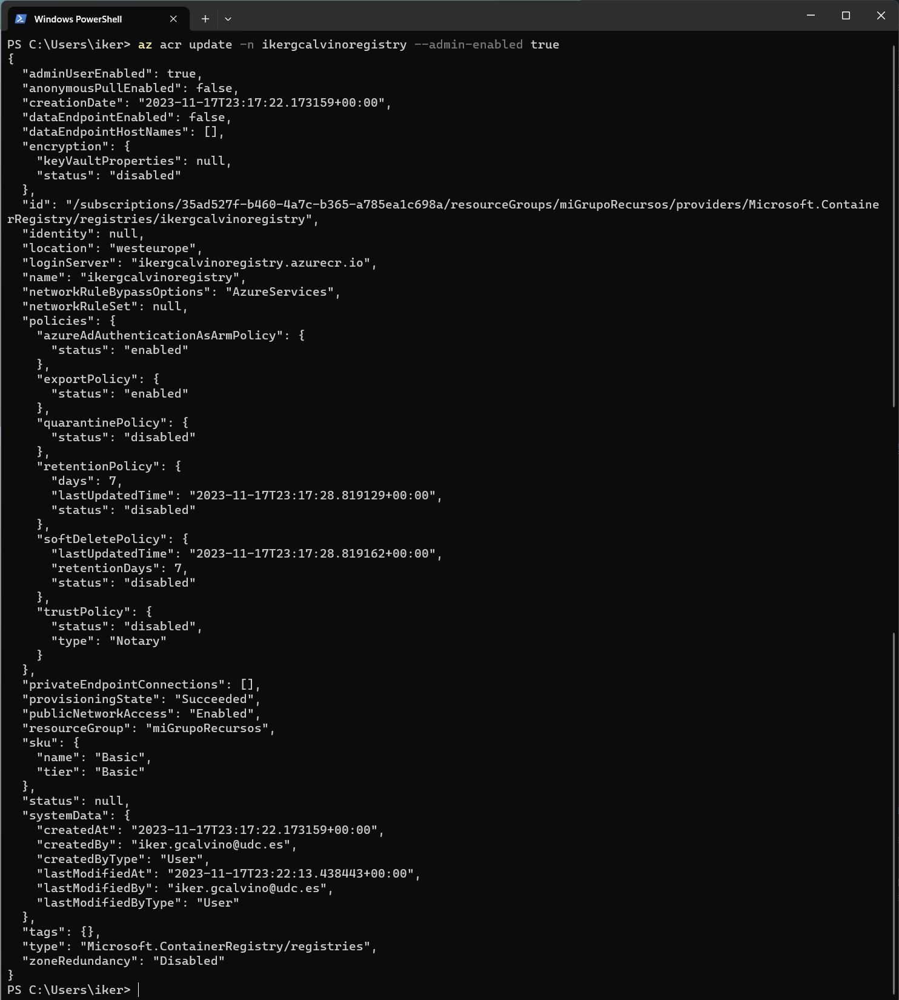

        Inicio de sesión en el registro de contenedores de Azure y push de imágenes:

        ```bash
        docker login ikergcalvinoregistry.azurecr.io
        docker push ikergcalvinoregistry.azurecr.io/wordpress:latest
        docker push ikergcalvinoregistry.azurecr.io/mysql:5.7
        ```

        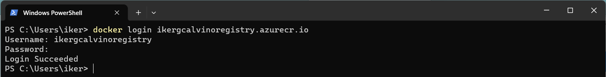
        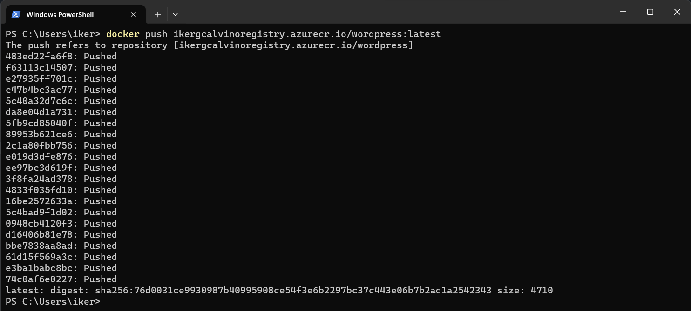
        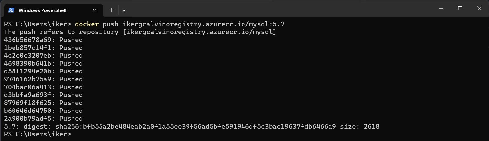
        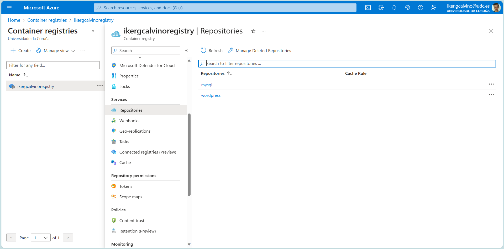

    - Creación de un plan de servicio de aplicaciones:

        ```bash
        az appservice plan create --name ikergcalvino-appservice-plan --resource-group miGrupoRecursos --sku B1 --is-linux
        ```

        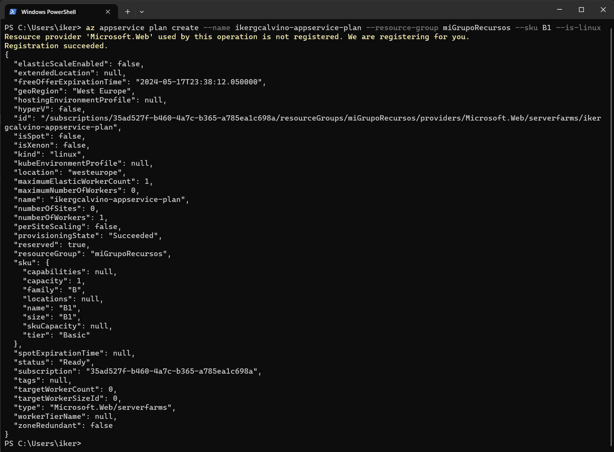

    - Creación de un servicio de aplicaciones web:

        ```bash
        az webapp create --name IkerGarciaWebApp --plan ikergcalvino-appservice-plan --resource-group miGrupoRecursos --multicontainer-config-file docker-compose.yml --multicontainer-config-type COMPOSE
        ```

        
        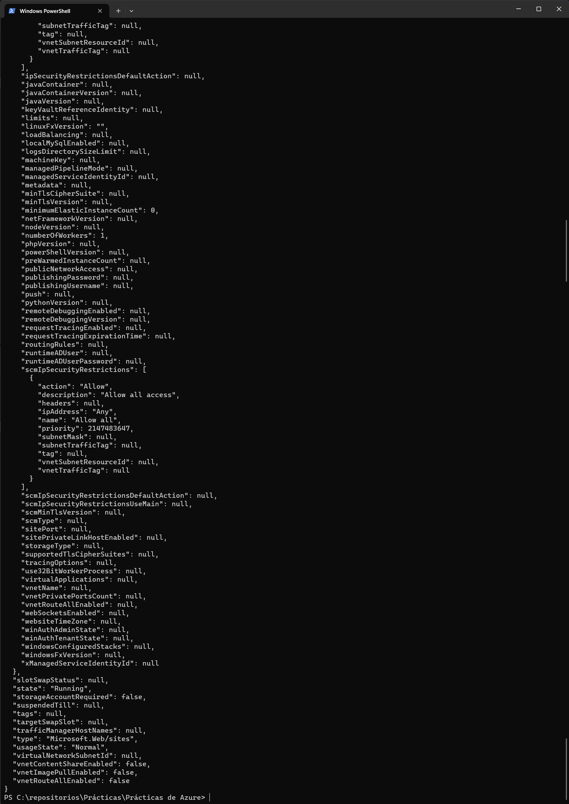

        Configuración del registro de contenedores en el servicio de aplicaciones web:

        ```bash
        az webapp config container set --name IkerGarciaWebApp --resource-group miGrupoRecursos --docker-registry-server-url ikergcalvinoregistry.azurecr.io --docker-registry-server-user ikergcalvinoregistry --docker-registry-server-password nbXfPUWkGsKLypLyHcBdo8OWJUS6TA+4eJfZrs82n1+ACRAfHh/0
        ```

        Configuración adicional:

        ```bash
        az webapp config appsettings set --resource-group miGrupoRecursos --name IkerGarciaWebApp --settings WEBSITES_ENABLE_APP_SERVICE_STORAGE=true
        ```

    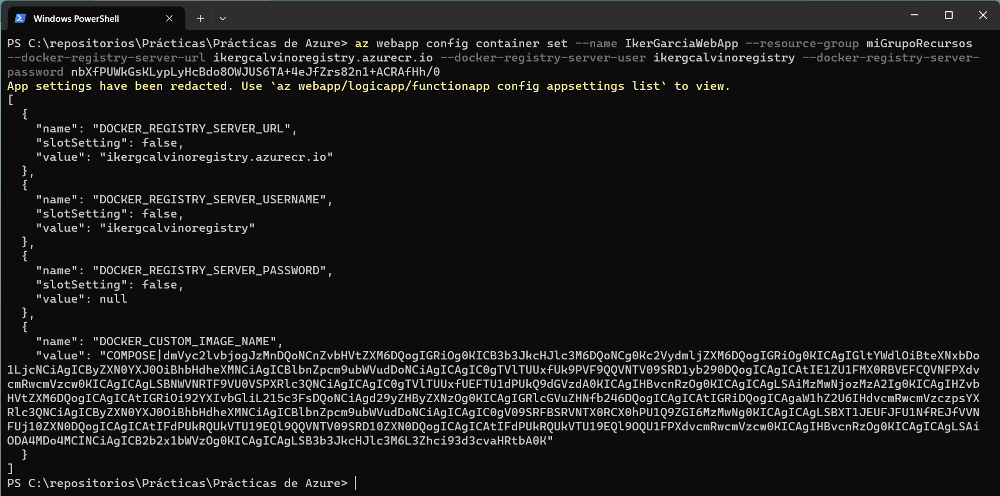

4. **Acceso a la aplicación en Azure:**

    Una vez completados los pasos anteriores, la aplicación estará disponible en la URL proporcionada por el servicio de aplicaciones web de Azure.

    - [IkerGarciaWebApp](https://ikergarciawebapp.azurewebsites.net)

    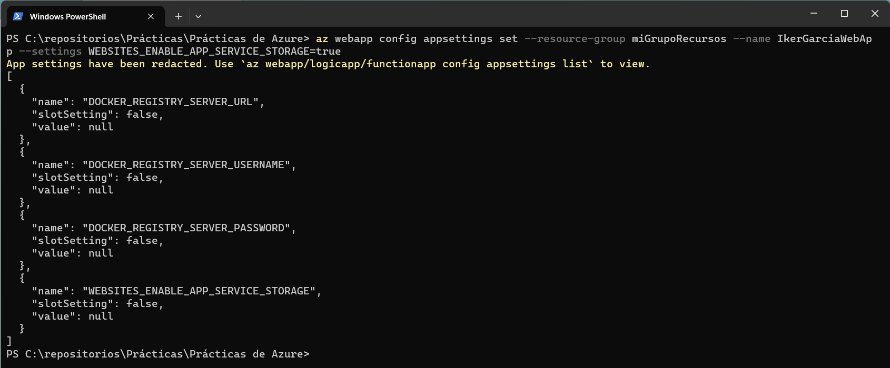
    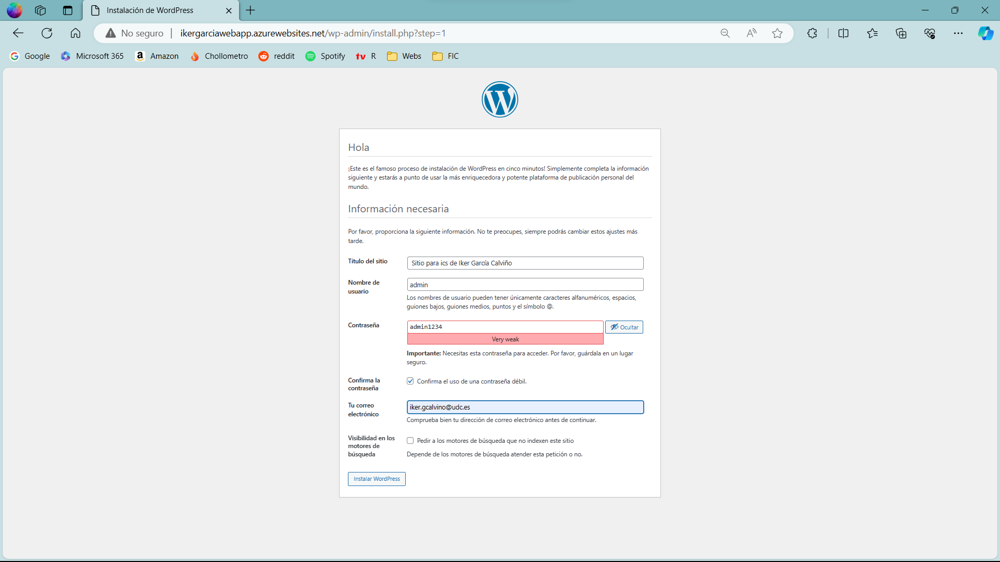
    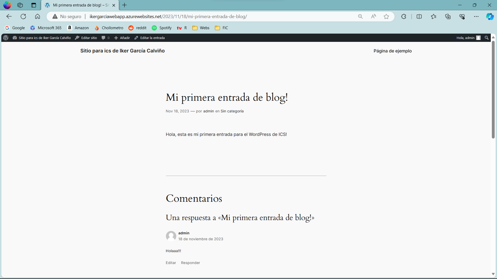
    
