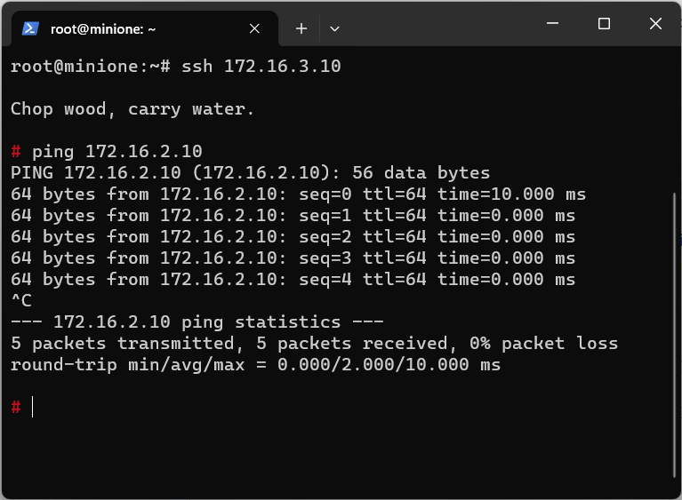

# Prácticas de OpenNebula

## Instrucciones instalación miniOne

OpenNebula cuenta con una implementación de front-end, donde todos los servicios están disponibles en un único host. Para la instalación del entorno all-in-one de OpenNebula, denominado miniOne, haremos uso de una máquina virtual:

> NOTA: Únicamente existen binarios para intel y amd, no para arm (apple M1-M2)

- VirtualBox (GPL, macOS/Windows/Linux)
- VMware Fusion (macOS)
- VMware Workstation Player (Windows/Linux)

También se puede usar:

- Qemu (free, GPL) for any platform
- Microsoft Hyper-V (Windows)
- KVM (free, GPL, Linux)

### Configuración de la máquina virtual

```
Nombre: minione
Sistemas Operativos: CentOS 7 o 8, Debian 9 o 10, Ubuntu 18.04 o 20.04 (preferentemente server 64-bit).
Sistema > Aceleración > Interfaz de paravirtualización: KVM
Memoria de video: 32 Mb
4 Gb RAM y 20 Gb HDD (SATA - VDI)
Últimas actualizaciones del S.O. instaladas y acceso en modo privilegiado (root).
Paquete openssh-server instalado. 
Red Adaptador 1: NAT
```

Nos aseguraremos de poder acceder desde el host anfitrión a la máquina instanciada en los siguientes puertos:

| Nombre   | Protocolo | Puerto Anfitrión | Puerto Invitado |
| :------- | :-------: | :--------------- | :-------------- |
| SSH      | TCP       | 2222             | 22              |
| SunStone | TCP       | 8080             | 80              |
| OCA      | TCP       | 2633             | 2633            |
| FireEdge | CP        | 2616             | 2616            |
| OneGate  | TCP       | 5030             | 5030            |

En VirtualBox se puede llevar a cabo gráficamente o con los comandos:

```
VBoxManage modifyvm "minione" --natpf1 "SSH,tcp,,2222,,22"
VBoxManage modifyvm "minione" --natpf1 "SunStone,tcp,,8080,,80"
VBoxManage modifyvm "minione" --natpf1 "OCA,tcp,,2633,,2633"
VBoxManage modifyvm "minione" --natpf1 "FireEdge,tcp,,2616,,2616"
VBoxManage modifyvm "minione" --natpf1 "OneGate,tcp,,5030,,5030"
```

> NOTA: Es conveniente realizar instantáneas durante el proceso de instalación para habilitar puntos de retorno.

### Instalación de miniOne

Una vez instanciada la máquina virtual (miniOne) en el hipervisor, accedemos y ejecutamos en modo privilegiado:

```
PS C:\Users\iker> ssh -p 2222 minione@localhost

minione@minione:~$ wget 'https://github.com/OpenNebula/minione/releases/latest/download/minione'

minione@minione:~$ sudo bash minione --force

### Checks & detection
Checking cpu virtualization capabilities  SKIP QEMU will be used
Checking augeas is installed  SKIP will try to install
Checking free disk space  IGNORE
Checking apt-transport-https is installed  SKIP will try to install
Checking AppArmor  SKIP will try to modify
Checking for present ssh key  SKIP
Checking (iptables|netfilter)-persistent are installed  SKIP will try to install
Checking docker is installed  SKIP will try to install
Checking python3-pip is installed  SKIP will try to install
Checking ansible  SKIP will try to install
Checking terraform  SKIP will try to install
Checking unzip is installed  SKIP will try to install

### Main deployment steps:
Install OpenNebula frontend version 6.8
Install Terraform
Install Docker
Configure bridge minionebr with IP 172.16.100.1/24
Enable NAT over enp0s3
Modify AppArmor
Install OpenNebula KVM node
Export appliance and update VM template
Install  augeas-tools apt-transport-https iptables-persistent netfilter-persistent python3-pip unzip
Install pip 'ansible==2.9.9'

Do you agree? [yes/no]:
yes

[...Installation...]

### Report
OpenNebula 6.8 was installed
Sunstone is running on:
  http://10.0.2.15/
FireEdge is running on:
  http://10.0.2.15:2616/
Use following to login:
  user: oneadmin
  password: feUTFIfOou
```

### Verificar que FireEdge está bien configurado

En el fichero `/etc/one/sunstone-server.conf` modificar:

```
######################################
# FireEdge
######################################
:private_fireedge_endpoint: http://localhost:2616
:public_fireedge_endpoint: http://localhost:2616
```

Reiniciar sunstone: `systemctl restart opennebula-sunstone`

### Verificar instalación

Para verificar la correcta instalación, acceder al interface web (http://localhost:8080) o bien desde CLI (ssh user@localhost -p 2222):

```
user@miniOne: sudo -i
root@miniOne:~# onehost list
 ID NAME        CLUSTER TVM ALLOCATED_CPU   ALLOCATED_MEM STAT
  0 localhost   default   0  0 / 400 (0%)  0K / 3.8G (0%) on
```

### OpenNebula Cloud API

Para el uso del Java OpenNebula Cloud API es necesario instalar:
- Un IDE como Eclipse IDE for Java Developers
- Descargar y modificar el Bulding Path para incorporar los JAR:
    - [org.opennebula.client.jar](Plantillas%20y%20librerías/lib/org.opennebula.client.jar) (descargar java-oca-6.8.0.tar.gz).
    - [xmlrpc-common-3.1.3.jar](Plantillas%20y%20librerías/lib/xmlrpc-common-3.1.3.jar)
    - [xmlrpc-client-3.1.3.jar](Plantillas%20y%20librerías/lib/xmlrpc-client-3.1.3.jar)
    - [ws-commons-util-1.0.2.jar](Plantillas%20y%20librerías/lib/ws-commons-util-1.0.2.jar)

## Documentación

- https://docs.opennebula.io/minione/
- https://docs.opennebula.io/
- https://docs.opennebula.io/6.8/integration_and_development/system_interfaces/java.html

## Ejercicios Básicos de OpenNebula

1. Acceder al GUI de miniOne mediante el usuario oneadmin y añadir todos los cluster, hosts (localhosts), redes (vnet) y datastores (files, system, default) a Virtual Data Centre (VDC) default.

```
root@minione:~# onevdc list
  ID NAME              GROUPS   CLUSTERS      HOSTS      VNETS DATASTORES
   0 default                2        ALL        ALL        ALL        ALL
```

2. Crear un usuario denominado userOne y un grupo denominado groupOne:
    - El usuario userOne pertenecerá al grupo groupOne.
    - Tendrá permisos para USE, MANAGE y CREATE sobre imágenes, plantillas y máquinas virtuales sobre la zona OpenNebula sobre los recursos del grupo groupOne.

```
root@minione:~# oneuser list
  ID NAME             ENAB GROUP    AUTH            VMS     MEMORY        CPU
   2 userOne          yes  groupOne core        0 /   -      0M /   0.0 /   -
   1 serveradmin      yes  oneadmin server_c    0 /   -      0M /   0.0 /   -
   0 oneadmin         yes  oneadmin core              -          -          -

root@minione:~# oneacl list
  ID     USER RES_VHNIUTGDCOZSvRMAPtB   RID OPE_UMAC  ZONE
  13       #2     V--I-T-------------  @100     um-c    #0
```

3. Crear una nueva plantilla de MV ttyLinux con los siguientes parámetros:
    - Hypervisor KVM, 256 Mb RAM y 0,2 CPU de Physical CPU.
    - Haciendo uso de la imagen ttyLinux-image.
    - Con una tarjeta en la red vnet y driver emulación *virtio* (teclear texto). Activar conexión RDP y SSH.
    - CPU Architecture x86_64, bus SATA.
    - Features: ACPI=no and APIC=no

```
root@minione:~# onetemplate show 1
TEMPLATE 1 INFORMATION
ID             : 1
NAME           : ttyLinux
USER           : oneadmin
GROUP          : oneadmin
LOCK           : None
REGISTER TIME  : 11/26 11:35:56

PERMISSIONS
OWNER          : um-
GROUP          : ---
OTHER          : ---

TEMPLATE CONTENTS
CONTEXT=[
  NETWORK="YES",
  SSH_PUBLIC_KEY="$USER[SSH_PUBLIC_KEY]" ]
CPU="0.2"
DISK=[
  IMAGE="ttyLinux-image",
  IMAGE_UNAME="oneadmin" ]
FEATURES=[
  ACPI="no",
  APIC="no" ]
GRAPHICS=[
  LISTEN="0.0.0.0",
  TYPE="VNC" ]
HOT_RESIZE=[
  CPU_HOT_ADD_ENABLED="NO",
  MEMORY_HOT_ADD_ENABLED="NO" ]
HYPERVISOR="kvm"
MEMORY="256"
MEMORY_RESIZE_MODE="BALLOONING"
MEMORY_UNIT_COST="MB"
NIC=[
  NETWORK="vnet",
  NETWORK_UNAME="oneadmin",
  RDP="YES",
  SECURITY_GROUPS="0",
  SSH="YES" ]
NIC_DEFAULT=[
  MODEL="virtio" ]
OS=[
  ARCH="x86_64",
  SD_DISK_BUS="sata" ]
```

4. Crear una máquina virtual persistente miLinux a partir de la plantilla ttyLinux creada anteriormente, asignándole la IP 172.16.100.10 (si no disponemos de la imagen, es necesario descargarla del marketplace previamente).

```
root@minione:~# ping 172.16.100.10
PING 172.16.100.10 (172.16.100.10) 56(84) bytes of data.
64 bytes from 172.16.100.10: icmp_seq=1 ttl=64 time=2.13 ms
64 bytes from 172.16.100.10: icmp_seq=2 ttl=64 time=0.755 ms
64 bytes from 172.16.100.10: icmp_seq=3 ttl=64 time=1.51 ms
64 bytes from 172.16.100.10: icmp_seq=4 ttl=64 time=0.653 ms
64 bytes from 172.16.100.10: icmp_seq=5 ttl=64 time=0.528 ms

--- 172.16.100.10 ping statistics ---
5 packets transmitted, 5 received, 0% packet loss, time 4029ms
rtt min/avg/max/mdev = 0.528/1.114/2.127/0.611 ms
```

5. Realizar una instantánea de la MV creada en el punto anterior. Modificar la IP de la tarjeta eth0 (ifconfig eth0 172.16.100.40) y verificar que podemos hacer ping a la nueva IP. Recuperar la instantánea para ver que restaura el valor inicial y hacer ping a la IP original (172.16.100.10).

    Para conexión con SSH se puede usar el comando:

    `$ ssh -oHostKeyAlgorithms=+ssh-rsa -oKexAlgorithms=+diffie-hellman-group1-sha1 root@172.16.100.10`

```
root@minione:~# onevm show 0
VIRTUAL MACHINE 0 INFORMATION

SNAPSHOTS
  ID         TIME NAME        HYPERVISOR_ID
   0  11/26 13:00 instantanea snap-0

CONTEXT=[
  ...
  ETH0_IP="172.16.100.10",
  ... ]

root@minione:~# ping 172.16.100.40
PING 172.16.100.40 (172.16.100.40) 56(84) bytes of data.
64 bytes from 172.16.100.40: icmp_seq=1 ttl=64 time=3.77 ms
64 bytes from 172.16.100.40: icmp_seq=2 ttl=64 time=1.71 ms
64 bytes from 172.16.100.40: icmp_seq=3 ttl=64 time=0.660 ms
64 bytes from 172.16.100.40: icmp_seq=4 ttl=64 time=0.750 ms
64 bytes from 172.16.100.40: icmp_seq=5 ttl=64 time=1.52 ms

--- 172.16.100.40 ping statistics ---
5 packets transmitted, 5 received, 0% packet loss, time 4117ms
rtt min/avg/max/mdev = 0.660/1.681/3.774/1.124 ms

root@minione:~# ping 172.16.100.10
PING 172.16.100.10 (172.16.100.10) 56(84) bytes of data.
From 172.16.100.1 icmp_seq=1 Destination Host Unreachable
From 172.16.100.1 icmp_seq=2 Destination Host Unreachable
From 172.16.100.1 icmp_seq=3 Destination Host Unreachable

--- 172.16.100.10 ping statistics ---
5 packets transmitted, 0 received, +3 errors, 100% packet loss, time 4089ms

root@minione:~# ping 172.16.100.10
PING 172.16.100.10 (172.16.100.10) 56(84) bytes of data.
64 bytes from 172.16.100.10: icmp_seq=1 ttl=64 time=14.4 ms
64 bytes from 172.16.100.10: icmp_seq=2 ttl=64 time=2.41 ms
64 bytes from 172.16.100.10: icmp_seq=3 ttl=64 time=1.79 ms
64 bytes from 172.16.100.10: icmp_seq=4 ttl=64 time=0.775 ms
64 bytes from 172.16.100.10: icmp_seq=5 ttl=64 time=0.632 ms

--- 172.16.100.10 ping statistics ---
5 packets transmitted, 5 received, 0% packet loss, time 4015ms
rtt min/avg/max/mdev = 0.632/4.002/14.407/5.243 ms
```

6. Crear un nuevo disco de 100Mb en formato ext3 y engancharlo a miLinux.

```
root@minione:~# onevm show 0
VIRTUAL MACHINE 0 INFORMATION

VM DISKS
 ID DATASTORE  TARGET IMAGE             SIZE      TYPE SAVE
  0 default    vda    miLinux-disk-0    -/200M    file  YES
  2 default    sda    miLinux-disk-1    -/100M    file   NO
  1 -          hda    CONTEXT           -/-       -       -
```

7. Redimensionar la memoria utilizada por miLinux, pasando de 256 a 512 Mb.

```
root@minione:~# onevm list
  ID USER     GROUP    NAME       STAT  CPU     MEM HOST            TIME
   0 oneadmin oneadmin miLinux    runn  0.2    256M localhost   1d 04h31

root@minione:~# onevm list
  ID USER     GROUP    NAME       STAT  CPU     MEM HOST            TIME
   0 oneadmin oneadmin miLinux    runn  0.2    512M localhost   1d 04h36
```

8. Asignar una cuota al usuario userOne para que sólo pueda instanciar UNA máquina. Posteriormente cambiar el propietario de la máquina ttyLinux y de la plantilla ttyLinux a userOne. Verificar que no se puede crear otra máquina con la plantilla ttyLinux para el usuario userOne.

```
root@minione:~# onetemplate instantiate ttyLinux --user=userOne --password=userOne --name=miLinuxNew
[one.template.instantiate] User [2] : user [2] limit of 1 reached for RUNNING_VMS quota in VM.
```

9. Crear una instancia de a partir de la plantilla ttyLinux denominada miLinuxSSH. Conectarse por ssh a esta máquina través del host localhost (Enganchar una NIC a la red vnet: IPv4 172.16.100.20).

```
root@minione:~# ssh root@172.16.100.20
Warning: Permanently added '172.16.100.20' (RSA) to the list of known hosts.

Chop wood, carry water.

#
```

10. Crear una red privada virtual miNET2 (172.16.2.0/24). Crear una nueva máquina a partir de la plantilla ttyLinux denominada miLinux2 y conectarla a la red miNET2. Crear una red privada virtual miNET3 (172.16.3.0/24). Crear una nueva máquina a partir de la plantilla ttyLinux denominda miLinux3 y conectarla a la red miNET3.

```
root@minione:~# onevm list
  ID USER     GROUP    NAME         STAT  CPU     MEM HOST            TIME
   3 oneadmin oneadmin miLinux3     runn  0.2    256M localhost   0d 00h01
   2 oneadmin oneadmin miLinux2     runn  0.2    256M localhost   0d 00h02
   1 oneadmin oneadmin miLinuxSSH   runn  0.2    256M localhost   0d 00h09
   0 userOne  groupOne miLinux      runn  0.2    512M localhost   1d 22h51

root@minione:~# onevnet list
  ID USER     GROUP    NAME       CLUSTERS   BRIDGE       STATE   LEASES OUTD ERRO
   2 oneadmin oneadmin miNET3     0          minionebr    rdy          1    0    0
   1 oneadmin oneadmin miNET2     0          minionebr    rdy          1    0    0
   0 oneadmin oneadmin vnet       0          minionebr    rdy          2    0    0
```

## Ejercicios Avanzados de OpenNebula

1. Crear dos redes privadas virtuales miNET2 (172.16.2.0/24) y miNET3 (172.16.3.0/24). Instanciar dos nuevas máquinas, a partir de la plantilla ttyLinux, denominadas miLinux2 y miLinux3 en las nuevas redes miNET2 y miNET3.

    Crear un router virtual miRouter que permita encaminar el tráfico entre las dos redes creadas:
    - Asignar la IP 172.16.2.10 a miLinux2
    - Asignar la IP 172.16.3.10 a miLinux3

```
root@minione:~# onevrouter list
  ID USER     GROUP    NAME
   0 oneadmin oneadmin miRouter
```



2. Verificar que está corriendo el servicio opennebula-flow

    `# service opennebula-flow status`

    Crear una plantilla de servicio con una máquina frontEnd como padre de server_master con rol master y server_slave con rol slave (se pueden lanzar hasta 3 máquinas). Reutilizar la plantilla ttyLinux para las máquinas frontEnd, server_master y server_slave. Garantizar que los roles server_master y server_slave no arrancan antes que frontEnd.

```
root@minione:~# onevm list
  ID USER     GROUP    NAME                          STAT  CPU     MEM HOST             TIME
   7 oneadmin oneadmin server_slave_0_(service_1)    runn  0.2    256M localhost    0d 00h03
   6 oneadmin oneadmin server_master_0_(service_1)   runn  0.2    256M localhost    0d 00h03
   5 oneadmin oneadmin frontEnd_0_(service_1)        runn  0.2    256M localhost    0d 00h03
   4 oneadmin oneadmin vr-miRouter-0                 runn    1    512M localhost    0d 00h53
   3 oneadmin oneadmin miLinux3                      runn  0.2    256M localhost    0d 01h53
   2 oneadmin oneadmin miLinux2                      runn  0.2    256M localhost    0d 01h54
   1 oneadmin oneadmin miLinuxSSH                    runn  0.2    256M localhost    0d 02h01
   0 userOne  groupOne miLinux                       runn  0.2    512M localhost    2d 00h43

root@minione:~# oneflow-template show 0
SERVICE TEMPLATE 0 INFORMATION
ID                  : 0
NAME                : miServicio
USER                : oneadmin
GROUP               : oneadmin
REGISTRATION TIME   : 11/28 12:57:27

PERMISSIONS
OWNER               : um-
GROUP               : ---
OTHER               : ---

TEMPLATE CONTENTS
{
  "name": "miServicio",
  "deployment": "straight",
  "default_cooldown": 3,
  "wait_timeout": 5,
  "shutdown_action": "terminate-hard",
  "roles": [
    {
      "name": "frontEnd",
      "cardinality": 1,
      "vm_template": 1,
      "elasticity_policies": [

      ],
      "scheduled_policies": [

      ]
    },
    {
      "name": "server_master",
      "cardinality": 1,
      "vm_template": 1,
      "parents": [
        "frontEnd"
      ],
      "min_vms": 0,
      "max_vms": 1,
      "elasticity_policies": [

      ],
      "scheduled_policies": [

      ]
    },
    {
      "name": "server_slave",
      "cardinality": 1,
      "vm_template": 1,
      "parents": [
        "frontEnd"
      ],
      "min_vms": 0,
      "max_vms": 3,
      "elasticity_policies": [

      ],
      "scheduled_policies": [

      ]
    }
  ],
  "description": "",
  "registration_time": 1701176247
}
```

3. Modificar la elasticidad del rol server_slave, para que cuando el valor del atributo MEMORY sea superior a 64, en los 2 últimos periodos de 5 segundos, se disminuya en 1 el pool de máquinas. El tiempo de espera después del escalado será de 5 segundos.

```
root@minione:~# oneflow show 3
SERVICE 3 INFORMATION
ID                  : 3
NAME                : miServicio
USER                : oneadmin
GROUP               : oneadmin
STRATEGY            : straight
SERVICE STATE       : RUNNING
START TIME          : 11/28 16:25:24
SHUTDOWN            : terminate-hard

PERMISSIONS
OWNER               : um-
GROUP               : ---
OTHER               : ---

ROLE frontEnd
ROLE STATE          : RUNNING
VM TEMPLATE         : 1
CARDINALITY         : 1

NODES INFORMATION
 VM_ID NAME                     USER            GROUP
     8 frontEnd_0_(service_3)   oneadmin        oneadmin

ROLE server_master
ROLE STATE          : RUNNING
PARENTS             : frontEnd
VM TEMPLATE         : 1
CARDINALITY         : 1
MIN VMS             : 0
MAX VMS             : 1

NODES INFORMATION
 VM_ID NAME                     USER            GROUP
     9 server_master_0_(service oneadmin        oneadmin

ROLE server_slave
ROLE STATE          : RUNNING
PARENTS             : frontEnd
VM TEMPLATE         : 1
CARDINALITY         : 1
MIN VMS             : 0
MAX VMS             : 3

ROLE ELASTICITY
ADJUST       EXPRESSION               EVALS PERIOD  COOL
- 1          MEMORY[74532.0] > 64       1/2     5s    5s

NODES INFORMATION
 VM_ID NAME                     USER            GROUP
    10 server_slave_0_(service_ oneadmin        oneadmin

LOG MESSAGES
11/28/23 16:25 [I] New state: DEPLOYING_NETS
11/28/23 16:25 [I] New state: DEPLOYING
11/28/23 16:28 [I] New state: RUNNING
```

4. Ajustar la cardinalidad del rol server_slave para que de lunes a viernes sea 3 a las 9:00, 2 a las 13:00 y 1 a las 22:30 h.

```
root@minione:~/templates# oneflow show 5
SERVICE 5 INFORMATION
ID                  : 5
NAME                : miServicio
USER                : oneadmin
GROUP               : oneadmin
STRATEGY            : straight
SERVICE STATE       : RUNNING
START TIME          : 11/28 16:52:42
SHUTDOWN            : terminate-hard

PERMISSIONS
OWNER               : um-
GROUP               : ---
OTHER               : ---

ROLE frontEnd
ROLE STATE          : RUNNING
VM TEMPLATE         : 1
CARDINALITY         : 1

NODES INFORMATION
 VM_ID NAME                     USER            GROUP
    11 frontEnd_0_(service_5)   oneadmin        oneadmin

ROLE server_master
ROLE STATE          : RUNNING
PARENTS             : frontEnd
VM TEMPLATE         : 1
CARDINALITY         : 1
MIN VMS             : 0
MAX VMS             : 1

NODES INFORMATION
 VM_ID NAME                     USER            GROUP
    12 server_master_0_(service oneadmin        oneadmin

ROLE server_slave
ROLE STATE          : RUNNING
PARENTS             : frontEnd
VM TEMPLATE         : 1
CARDINALITY         : 3
MIN VMS             : 0
MAX VMS             : 3

ROLE ELASTICITY
ADJUST       EXPRESSION               EVALS PERIOD  COOL
- 1          MEMORY[264910.67] > 64     1/2     5s    5s

ROLE ELASTICITY SCHEDULE
ADJUST       TIME
= 3          0 9 * * mon,tue,wed,thu,fri
= 2          0 13 * * mon,tue,wed,thu,fri
= 1          30 22 * * mon,tue,wed,thu,fri

NODES INFORMATION
 VM_ID NAME                     USER            GROUP
    13 server_slave_0_(service_ oneadmin        oneadmin
    14 server_slave_1_(service_ oneadmin        oneadmin
    15 server_slave_2_(service_ oneadmin        oneadmin

LOG MESSAGES
11/28/23 16:52 [I] New state: DEPLOYING_NETS
11/28/23 16:52 [I] New state: DEPLOYING
11/28/23 16:59 [I] New state: RUNNING
```

5. Utilizando la Java OCA API, programar la creación de una nueva máquina virtual a partir de la plantilla ttyLinux creada en el ejercicio 3 del apartado básico.

```java
import org.opennebula.client.Client;
import org.opennebula.client.OneResponse;
import org.opennebula.client.template.Template;

public class MiniOne {

    public static void main(String[] args) {
        try {
            Client oneClient = new Client("oneadmin:feUTFIfOou", null);
            Template ttyLinux = new Template(2, oneClient);
            OneResponse response = ttyLinux.instantiate("nueva-maquina");
            System.out.println("El id de la nueva máquina instanciada es: " + response.getMessage());
        } catch (Exception e) {
            System.out.println(e.getMessage());
        }
    }

}
```

```
El id de la nueva máquina instanciada es: 16
```
